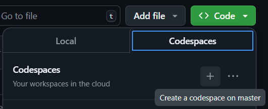

# Intune Ninja

## Overview

Intune Ninja is an AI-powered tool that provides insights on Intune data using Microsoft Graph API. It allows users to interact with the AI to retrieve information and perform actions related to Intune.

## Features

- Chat with AI to get insights on Intune data.
- Call Microsoft Graph API to fetch data.
- Interpret the data and provide suggestions.
- User-friendly interface built with Streamlit.

## Quickstart

No need for installation thanks to our Streamlit app!

[](https://intunecopilot.streamlit.app/)

<details>
<summary>Instructions for manual installation</summary>

### Requirements

- Python 3.x
- Required packages:
  - `dotenv`
  - `openai`
  - `streamlit`

### Installation

The quickest way to set up your environment is by using GitHub Codespaces. Simply click on the green "Code" button in the repository and select "Open with Codespaces" to launch a ready-to-use development environment without any additional setup.



<details>
<summary>Manual setup</summary>

1. Clone the repository:

   ```bash
   git clone <repository-url>
   cd <repository-directory>
   ```

2. Install the required packages:

   ```bash
   pip install -r requirements.txt
   ```

</details>

### Configuration

 Rename or make a copy of the `secrets.toml.example` file in the root directory, rename it to `secrets.toml` and add your API key for OpenAI and client ID, secret, and tenant ID for Microsoft Graph API.

### Usage

Run the application:

```bash
streamlit run main.py
```

Open your browser and navigate to `http://localhost:8501` to access the application.

</details>

## Contributing

Feel free to submit issues or pull requests. Contributions are welcome!

## License

This project is licensed under the MIT License.
