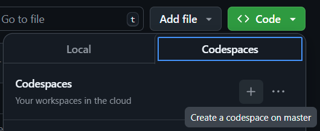

# 🥷 Intune Ninja

## Overview

Intune Ninja is an AI-powered tool that provides insights on Intune data using Microsoft Graph API. It leverages an OpenAI assistant to interpret user queries and generate an accurate URL to call the Microsoft Graph API.

## Features

- Prompt for any Intune or Entra ID related data to get the URL to call the Microsoft Graph API.
- Chat with AI to get insights on Intune data or just learn more about the Microsoft Graph API.
- Interpret the data and provide suggestions.
- User-friendly interface built with Streamlit.

## Quickstart

No need for installation thanks to our Streamlit app!

[](https://intune-ninja.streamlit.app/)

You do need to have an OpenAI account and a payment method linked to it. Grab an API key, as well as the client ID and secret of your Entra ID registered application for Graph.

<details>
<summary>Instructions for manual installation</summary>

### Requirements

- OpenAI API key
- Microsoft Graph API client ID, secret, and tenant ID
- Python 3.11 or higher
- Required packages:
  - `dotenv`
  - `openai`
  - `streamlit`

### Installation

The quickest way to set up your environment is by using GitHub Codespaces. Simply click on the green "Code" button in the repository and select "Open with Codespaces" to launch a ready-to-use development environment without any additional setup.



<details>
<summary>Manual setup</summary>

1. Clone the repository:

   ```bash
   git clone <repository-url>
   cd <repository-directory>
   ```

2. Install the required packages:

   ```bash
   pip install -r requirements.txt
   ```

</details>

### Configuration

 Rename or make a copy of the `secrets.toml.example` file in the root directory, rename it to `secrets.toml` and add your API key for OpenAI and client ID, secret, and tenant ID for Microsoft Graph API.

### Usage

Run the application:

```bash
streamlit run main.py
```

Open your browser and navigate to `http://localhost:8501` to access the application.

</details>

## Setup

1. Clone the repository
2. Install the required packages: `pip install -r requirements.txt`
3. Set up your secrets:
   - For local development:
     - Create a file `.streamlit/secrets.toml` in your project root.
     - Add your secrets to this file:
       ```toml
       OpenAI_API_key = "your_openai_api_key"
       Graph_proxy_TENANT_ID = "your_tenant_id"
       Graph_proxy_CLIENT_ID = "your_client_id"
       Graph_proxy_CLIENT_SECRET = "your_client_secret"
       LLM_MODEL = "o3-mini"  # or your preferred model
       ```
   - For deployment (e.g., Streamlit Cloud):
     - Use the platform's secret management system to set these values.
     - Do not include the `.streamlit/secrets.toml` file in your deployment.
4. Run the Streamlit app: `streamlit run main.py`

Note: The app uses `st.secrets` to access these values, which works seamlessly in both local and deployed environments.

## Contributing

Feel free to submit issues or pull requests. Contributions are welcome!

## License

This project is licensed under the MIT License.
